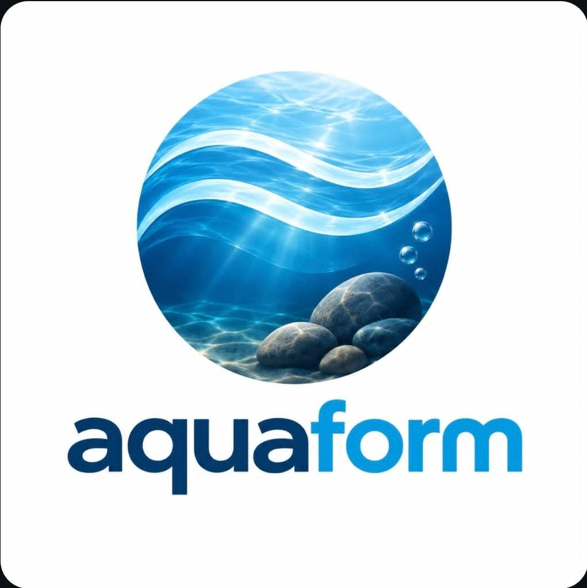
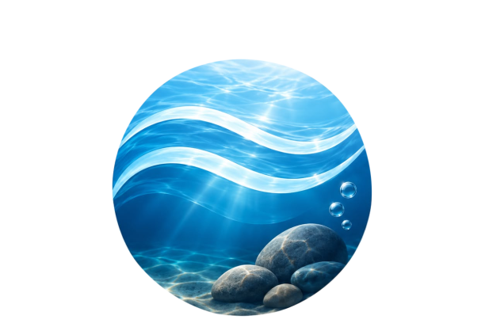

# AquaSample 💧

**AquaSample** es una aplicación móvil desarrollada como proyecto universitario, orientada a digitalizar y estandarizar el proceso de toma, registro y revisión de muestras de agua en campo, reemplazando el uso de bitácoras físicas y formularios en papel.

---

## 1. Problema y usuarios reales

Los equipos de campo encargados de la toma de muestras de agua (potabilización, control de calidad, saneamiento ambiental) suelen registrar sus observaciones en papel o en formularios desconectados, lo que genera:

- Pérdida o ilegibilidad de datos.
- Falta de trazabilidad entre la muestra tomada y su revisión posterior.
- Demoras en la validación por parte de un supervisor.

**Usuarios reales identificados:**

- **Operador/técnico de campo:** toma la muestra, registra el conteo, observaciones y evidencia fotográfica.
- **Supervisor:** revisa, valida o rechaza las muestras cargadas por los operadores.

El detalle completo del problema, el contexto y la justificación del proyecto se encuentra documentado en:
📄 [`docs/Evidencia_Clase_01_MVP_EquipoXX.docx`](docs/Evidencia_Clase_01_MVP_EquipoXX.docx)

---

## 2. Requerimientos y definición del MVP

Los requerimientos funcionales y no funcionales del sistema, junto con el alcance definido para el **Producto Mínimo Viable (MVP)**, están especificados en la evidencia de la Clase 1:

📄 [`docs/Evidencia_Clase_01_MVP_EquipoXX.docx`](docs/Evidencia_Clase_01_MVP_EquipoXX.docx)

Dicho documento cubre:

- Requerimientos funcionales (registro de muestras, conteo, fotografía, historial, revisión de supervisor, etc.).
- Requerimientos no funcionales (usabilidad, disponibilidad, seguridad de datos, entre otros).
- Alcance y límites definidos para el MVP.

---

## 3. Historias de usuario y alcance

Las historias de usuario que guiaron el diseño del flujo y las pantallas del MVP, junto con el alcance funcional resultante, se documentan en:

📄 [`docs/Actividad_Clase_2_Flujo_UML_Diseno_Interfaces.docx`](docs/Actividad_Clase_2_Flujo_UML_Diseno_Interfaces.docx)

---

## 4. Diagrama de Actividad UML (Flujo de usuario)

El diagrama de actividad UML que modela el flujo de uso de la aplicación —desde el login del operador hasta la revisión final del supervisor— se encuentra incluido en:

📄 [`docs/Actividad_Clase_2_Flujo_UML_Diseno_Interfaces.docx`](docs/Actividad_Clase_2_Flujo_UML_Diseno_Interfaces.docx)

---

## 5. Diseño de interfaces e identidad visual (Material Design 3)

El diseño visual de AquaSample está construido sobre los lineamientos de **Material Design 3**, con una paleta de colores, tipografía (Inter) y tokens de diseño definidos en el sistema:

🎨 [`AquaSample_MVP_Stitch/MVP/corporate_precision_system/DESIGN.md`](AquaSample_MVP_Stitch/MVP/corporate_precision_system/DESIGN.md)

### Identidad visual (logo e ícono)

| Logo | Ícono de app |
|------|--------------|
|  |  |

### Mockups de pantallas (MVP)

El detalle del diseño de interfaces también se documenta en [`docs/Actividad_Clase_2_Flujo_UML_Diseno_Interfaces.docx`](docs/Actividad_Clase_2_Flujo_UML_Diseno_Interfaces.docx). Las pantallas prototipadas (HTML + capturas) del MVP son:

| Pantalla | Descripción | Vista previa (HTML) |
|----------|-------------|----------------------|
| Login | Inicio de sesión del operador | [`login.html`](AquaSample_MVP_Stitch/MVP/aquamuestra_login/login.html) |
| Nueva muestra | Registro de una nueva muestra de agua | [`nueva_muestra.html`](AquaSample_MVP_Stitch/MVP/aquamuestra_nueva_muestra/nueva_muestra.html) |
| Conteo y observaciones | Registro de conteo y observaciones de la muestra | [`conteo.html`](AquaSample_MVP_Stitch/MVP/aquamuestra_conteo_y_observaciones/conteo.html) |
| Fotografía de muestra | Captura de evidencia fotográfica | [`fotografia.html`](AquaSample_MVP_Stitch/MVP/aquamuestra_fotograf_a_de_muestra/fotografia.html) |
| Resumen de muestra | Resumen previo al envío para revisión | [`resumen.html`](AquaSample_MVP_Stitch/MVP/aquamuestra_resumen_de_muestra/resumen.html) |
| Historial de muestras | Listado histórico de muestras registradas | [`historial.html`](AquaSample_MVP_Stitch/MVP/aquamuestra_historial_de_muestras/historial.html) |
| Revisión del supervisor | Validación/rechazo de muestras por el supervisor | [`revision.html`](AquaSample_MVP_Stitch/MVP/aquamuestra_revisi_n_supervisor/revision.html) |

> Cada carpeta de pantalla contiene además una imagen `.png` con la captura estática del diseño correspondiente.

---

## 6. Evidencias documentales (resumen de rutas)

| Evidencia | Ruta |
|-----------|------|
| Problema, usuarios, requerimientos y MVP (Clase 1) | [`docs/Evidencia_Clase_01_MVP_EquipoXX.docx`](docs/Evidencia_Clase_01_MVP_EquipoXX.docx) |
| Historias de usuario, UML y diseño de interfaces (Clase 2) | [`docs/Actividad_Clase_2_Flujo_UML_Diseno_Interfaces.docx`](docs/Actividad_Clase_2_Flujo_UML_Diseno_Interfaces.docx) |
| Sistema de diseño (Material Design 3) | [`AquaSample_MVP_Stitch/MVP/corporate_precision_system/DESIGN.md`](AquaSample_MVP_Stitch/MVP/corporate_precision_system/DESIGN.md) |
| Identidad visual (logo e ícono) | [`docs/diseno/`](docs/diseno/) |
| Prototipos de pantallas del MVP (HTML + PNG) | [`AquaSample_MVP_Stitch/MVP/`](AquaSample_MVP_Stitch/MVP/) |

---

## Estructura del repositorio

```
AquaSample/
├── docs/
│   ├── Evidencia_Clase_01_MVP_EquipoXX.docx
│   ├── Actividad_Clase_2_Flujo_UML_Diseno_Interfaces.docx
│   └── diseno/
│       ├── logo.png
│       └── aquaicon.png
└── AquaSample_MVP_Stitch/
    └── MVP/
        ├── aquamuestra_login/
        ├── aquamuestra_nueva_muestra/
        ├── aquamuestra_conteo_y_observaciones/
        ├── aquamuestra_fotograf_a_de_muestra/
        ├── aquamuestra_resumen_de_muestra/
        ├── aquamuestra_historial_de_muestras/
        ├── aquamuestra_revisi_n_supervisor/
        └── corporate_precision_system/
            └── DESIGN.md
```
