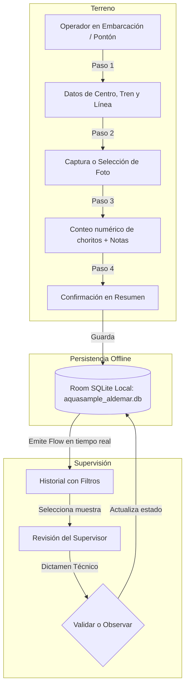

# AquaSample · ALDEMAR SpA (Módulo Móvil Android) 📱🌊

Aplicación móvil desarrollada en **Kotlin** y **Jetpack Compose** para la asignatura **DSY1105 - Desarrollo de Aplicaciones Móviles** (Duoc UC), orientada a digitalizar y estandarizar la toma, trazabilidad y revisión técnica de muestras de líneas de cultivo de choritos para la empresa **ALDEMAR SpA**.

---

## 👥 Integrantes del Equipo (Los Royales - n°4)
* **Matías Mena:** Lógica de datos, base de datos local Room (Offline-First), Repository, ViewModels y arquitectura.
* **Antoine Rivas:** Implementación de pantallas en Jetpack Compose y diseño de interfaces.
* **Leandro Ruiz:** Pruebas funcionales, validaciones de terreno y testing.
* **Franco Ruz:** Coordinación general y gestión del proyecto.

---

## 🏛️ Arquitectura del Proyecto (MVVM + Clean Architecture básica)

El código se encuentra organizado dentro del paquete `com.aldemar.aquasample`:

```text
com.aldemar.aquasample/
├── AquaSampleApp.kt             # Application class: Instancia Singleton de Room y carga inicial de datos
├── MainActivity.kt              # Single Activity: Contenedor que aloja AquaNavigation y el tema
│
├── data/                        # CAPA DE DATOS (Backend local)
│   ├── local/
│   │   ├── AquaSampleDatabase.kt # Base de datos Room SQLite con precarga automática de centros y muestras demo
│   │   ├── dao/
│   │   │   └── SampleDao.kt     # Consultas SQL reactivas con corrutinas y Flow
│   │   └── entity/
│   │       ├── SampleEntity.kt  # Tabla 'samples': Trazabilidad por Centro, Tren, Línea, Conteo y Foto
│   │       └── CenterEntity.kt  # Tabla 'centers': Catálogo de centros de cultivo de la región
│   ├── model/
│   │   ├── SampleStatus.kt      # Enum de estados: PENDIENTE, VALIDADO, OBSERVADO
│   │   └── UserRole.kt          # Enum de roles: OPERADOR, SUPERVISOR
│   └── repository/
│       └── SampleRepository.kt  # Única fuente de verdad: conecta DAOs con ViewModels en hilos de I/O
│
└── ui/                          # CAPA DE PRESENTACIÓN (Jetpack Compose + Material 3)
    ├── theme/                   # Tokens de diseño oficiales (DESIGN.md): Colores ALDEMAR, Tipografía y Tema
    ├── components/              # Componentes reutilizables (AquaTopBar, StatusBadge)
    ├── navigation/              # Grafo de navegación y rutas de pantalla (Screen, AquaNavigation)
    ├── viewmodel/               # ViewModels con StateFlow reactivo:
    │   ├── AuthViewModel.kt     # Gestión del usuario activo y cambio de rol
    │   ├── SampleListViewModel.kt # Búsqueda y filtrado dinámico de muestras
    │   ├── SampleCreateViewModel.kt # Flujo temporal de creación a lo largo de los 4 pasos
    │   └── SupervisorReviewViewModel.kt # Dictamen técnico y validación del supervisor
    └── screens/
        ├── login/               # Pantalla de acceso por rol
        ├── home/                # Pantalla principal con historial, badges y FAB
        ├── sample/              # Asistente de 4 pasos para registro de muestra:
        │   ├── NewSampleScreen.kt         # Paso 1: Ubicación (Centro, Tren, Línea) y tramo
        │   ├── PhotoCaptureScreen.kt      # Paso 2: Evidencia fotográfica
        │   ├── CountObservationsScreen.kt # Paso 3: Conteo numérico ergonómico y notas
        │   └── SampleSummaryScreen.kt     # Paso 4: Ficha resumen y guardado en SQLite
        └── review/
            └── SupervisorReviewScreen.kt  # Revisión técnica con botones de Validar u Observar
```

---

## ⚡ Flujo de Datos y Funcionamiento Offline



---

## 🚀 Cómo abrir y ejecutar el proyecto

1. Abrir **Android Studio**.
2. Ir a **File ➔ Open** y seleccionar la carpeta:
   ```text
   .../AquaSample/aldemar
   ```
3. Esperar a que Gradle sincronice las dependencias.
4. Seleccionar el emulador o celular Android y hacer clic en **Play ▶️** (`Shift + F10`).
